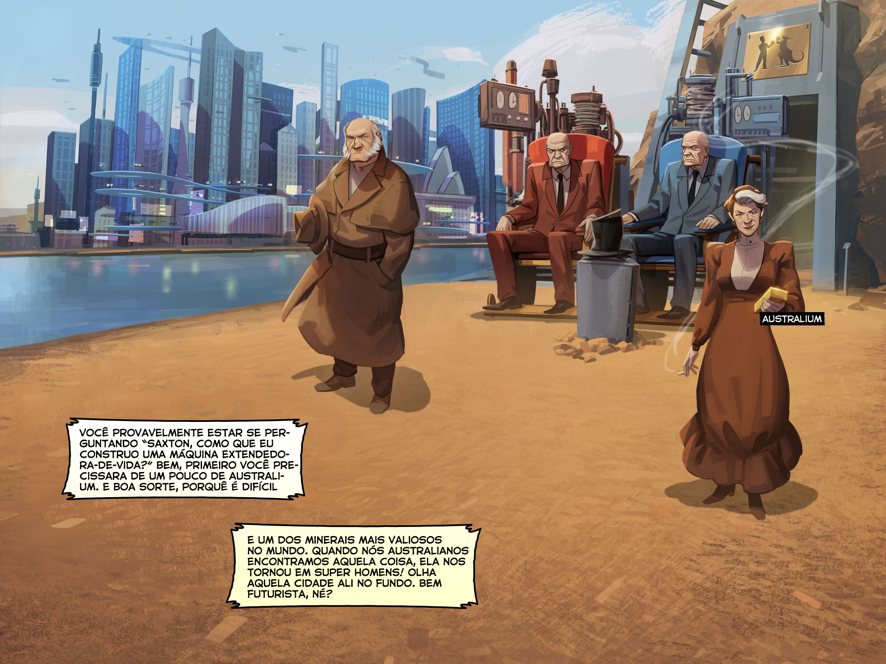

| Original | Tradução |
| -------- | -------- |
| HELLO, SIX-YEAR-OLDS AND PARENTS READING TO THREE-YEAR-OLDS! | OLÁ, CRIANÇAS DE SEIS ANOS E PAIS LENDO PARA RECÉM-NACIDOS! |
| UNTIL RECENTLY, COMICS WERE JUST PICTURE BOOKS USED TO DISTRACT SMALL CHILDREN! | ATÉ AGORA, QUADRINHOS ERAM APENAS LIVROS COM DESENHOS USADOS PARA DISTRAIR CRIANÇAS PEQUENAS! |
| NOT ANYMORE! THANKS TO TEAM FORTRESS COMICS, THEY'RE NOW ***BLOOD-SOAKED, ADRENALINE-GORGED ORGIES OF PICTURE VIOLENCE*** THAT'LL DISTRACT KIDS OF ***ALL*** AGES! | PORÉM, NÃO MAIS! GRAÇAS AOS QUADRINHOS DO TEAM FORTRESS, ELES AGORA SÃO ***ORGIAS DE VIOLÊNCIA EM IMAGENS, ENSANGUENTADAS E CHEIAS DE ADRENALINA,*** QUE VÃO DISTRAIR CRIANÇAS DE ***TODAS*** AS IDADES! |
|  |  |
| I’M ***SAXTON HALE!*** AND IF YOU DON‘T KNOW WHO I AM YOU’RE PROBABLY AN IDIOT! OR A CHILDLESS ADULT.| EU SOU ***SAXTON HALE!*** E CASO VOCÊ NÃO ME CONHEÇA VOCÊ PROVAVELMENTE É UM IDIOTA! OU UM ADULTO SEM FAMÍLIA. |
| BUT DON’T WORRY! BECAUSE THE COMIC YOU’RE NOW READING HAS BEEN WRITTEN, ***BY HAND***, WITH THE EXPRESS PURPOSE OF CATCHING YOU UP ON SEVEN YEARS OF BACKSTORY, SO YOU CAN GET TO THE ***GOOD*** STUFF... | MAS NÃO SE PREOCUPE! PORQUE O QUADRINHO QUE VOCÊ ESTÁ LENDO AGORA FOI ESCRITO, ***A MÃO***, COM O ÚNICO PROPÓSITO DE TE FAZER UMA BREVE RECAPITULAÇÃO DE SETE ANOS DE HISTÓRIA, PARA QUE VOCÊ POSSA CHEGAR NA PARTE ***BOA***... |
| ***ISSUE #1 OF OUR ONGOING TEAM FORTRESS COMIC BOOK!*** | ***1ª EDIÇÃO DO QUADRINHO CONTINUO DO TEAM FORTRESS!*** |
| SO YOU'D BETTER SIT DOWN, BECAUSE—ON SECOND THOUGHT, STAND. YOU DON‘T WANT TO BE IN A COMFORTABLE BOWEL-EMPTYING POSITION FOR THE ***ROCKET-SLED OF EXPOSITION*** YOU’RE ABOUT TO BE STRAPPED TO! | ENTÃO É MELHOR VOCÊ SE SENTAR, PORQUE—PENSANDO BEM, LEVANTA. VOCÊ NÃO VAI QUERER FICAR EM UMA POSIÇÃO CONFORTÁVEL DE ESVAZIAMENTO INTESTINAL PARA O ***TRENÓ Á JATO DE EXPOSIÇÃO*** AO QUAL VOCÊ ESTÁ PRESTES A SER AMARRADO! |
| LET'S GET STARTED! | VAMOS COMEÇAR! |
|  |  |
| OUR STORY STARTS IN NEW MEXICO. IT’S A DESERT, AND IT LOOKS LIKE THIS. ONLY A MORON WOULD LIVE HERE. | A NOSSA HISTÓRIA COMEÇA NO NOVO MÉXICO. É UM DESERTO, ESSE DAQUI. APENAS IMBECIL MORARIA AQUI. |
|  |  |
| HERE’S SOME MORONS WHO DECIDED TO LIVE HERE. A RICH OLD MAN FROM ENGLAND AND HIS TWIN IDIOT SONS. | AQUI ALGUNS DO IMBECIS QUE DECIDIRAM MORAR AQUI. UM HOMEM RICO E VELHO DA INGLATERRA E SEUS GÊMEOS IDIOTAS. |
| THE BOYS ***HATED*** EACH OTHER! BUT THEY LOVED THEIR DAD, AND THEY CONVINCED HIM TO BUY MOST OF NEW MEXICO AND MOVE THERE. | OS GAROTOS SE ***ODIAVAM!*** MAIS AMAVAM SEU PAI, E ELES O CONVENCERAM A COMPRAR MAIOR PARTE DO NOVO MÉXICO E SE MUDARAM PARA LÁ. |
| THE OLD MAN NEVER FORGAVE THEM FOR IT. | O VELHO HOMEM NUNCA OS PERDOOU POR ISSO. |
|  |  |
| ON HIS DEATHBED, HE LEFT THE FAMILY MUNITIONS COMPANY (MANN CO.) TO HIS TRUSTED AIDE... | EM SEU LEITO DE MORTE, ELE DEIXOU A COMPANHIA DE MUNIÇÕES DA FAMÍLIA (MANN CO.) AO SEU ASSISTENTE DE CONFIANÇA... |
| (MY GRANDDAD) | (MEU AVÔ) |
|  |  |
| ...HE LEFT HIS MAIDSERVANT ALL HIS GOLD... | ...ELE DEIXOU PARA SUA SERVA TODO O SEU OURO... |
|  |  |
| ...AND HE LEFT HIS SONS ***NOTHING.*** | ...E PARA SEUS FILHOS ELE NÃO DEIXOU ***NADA.*** |
|  |  |
| NOTHING BUT THE USELESS LAND THEY’D CONVINCED HIM TO BUY. AND HE GAVE IT TO THEM TO ***SHARE.*** SO THEY’D FIGHT OVER IT UNTIL THE DAY ***THEY*** DIED. | NADA ALÉM DO TERRENO INÚTIL QUE ELES CONVENCERAM ELE A COMPRAR. E ELE DEU A ELES PARA ***DIVIDIREM.*** ENTÃO ELES DECIDIRAM LUTAR POR ELE ATÉ O DIA DE ***SUAS*** MORTES. |
|  |  |
| ONE OF THE BROTHERS HIRED MERCENARIES TO SEIZE THE LAND FROM HIS TWIN. BUT THE OTHER BROTHER DID TOO! | UM DOS IRMÃOS CONTRATOU MERCENÁRIOS PARA TOMAR AS TERRAS DO SEU IRMÃO. MAS O OUTRO IRMÃO TÁMBEM FEZ A MESMA COISA! |
| THE ENSUING LAND WAR HAS GONE ON FOR A HUNDRED AND TWENTY YEARS NOW — AS DRAMATIZED IN THE DOCUMENTARY VIDEO GAME TEAM FORTRESS 2! | A GUERRA DE TERRENO QUE JÁ ESTA ACONTECENDO HÁ CENTO E VINTE ANOS — CONFORME DOCUMENTADO E DRAMATIZADO NO JOGO TEAM FORTRESS 2! |
|  |  |
| YEARS PASSED. THE BROTHERS WERE CLOSE TO DEATH, BUT NO CLOSER TO STEALING THEIR WORTHLESS INHERITANCE FROM ONE ANOTHER. | ANOS PASSARAM. OS IRMÃOS ESTAVAM PRÓXIMO DA MORTE, MAS NÃO PRÓXIMO DE ROUBAR SUA HERANÇA INÚTIL UM DO OUTRO. |
| THAT’S WHERE THIS SHARP OLD TACK COMES IN. | É AÍ QUE ESSE VELHOTE ESPERTO ENTRA EM CENA. |
| ONE OF THE BROTHERS HIRED A BRILLIANT ENGINEER TO BUILD A MACHINE THAT’D MAKE HIM LIVE FOREVER! | UM DOS IRMÃOS CONTRATOU UM ENGENHEIRO BRILHANTE PARA CONSTRUIR UMA MÁQUINA QUE O FAZESSE VIVER PARA SEMPRE! |
| IF HE COULDN’T ***BEAT*** HIS TWIN FOR THE LAND, HE’D ***OUTLAST*** HIM FOR IT! | SE ELE NÃO PUDESSE ***VENCER*** O IRMÃO, ELE ***GANHARIA*** POR TEMPO! |
|  |  |
| ONLY PROBLEM WAS, ***THIS*** LADY SECRETLY CONVINCED THE ENGINEER TO BUILD A MACHINE FOR THE ***OTHER*** BROTHER TOO! |O PROBLEMA ERA QUE, ***ESSA*** MOÇA, SECRETAMENTE CONVENCEU O ENGENHEIRO A CONSTRUIR A MÁQUINA PARA O ***OUTRO*** IRMÃO TÁMBEM! |
| WHY? NOBODY KNOWS. BUT NOW THE BROTHERS ARE BOTH PRACTICALLY IMMORTAL, STILL IDIOTS, AND DOOMED TO PIT THEIR MERCS AGAINST EACH OTHER ***FOREVER!*** | POR QUE? SEI LÁ. MAS AGORA OS DOIS IRMÃO SÃO BASICAMENTE IRMORTAIS, AINDA IDIOTAS, E CONDENADOS A COLOCAR SEUS MERCENÁRIOS UNS CONTRA OS OUTROS PARA ***SEMPRE!***  |
|  |  |
| AUSTRALIUM | AUSTRÁLIO |
| YOU’RE PROBABLY ASKING, “SAXTON, HOW CAN I BUILD A LIFE-EXTENDING MACHINE?” WELL, FIRST YOU’D NEED SOME ***AUSTRALIUM***. AND GOOD LUCK, ‘CAUSE IT’S HARD TO COME BY. | VOCÊ PROVAVELMENTE ESTAR SE PERGUNTANDO “SAXTON, COMO QUE EU CONSTRUO UMA MáQUINA EXTENDEDORA-DE-VIDA?” BEM, PRIMEIRO VOCÊ PRECISARÁ DE UM POUCO DE ***AUSTRÁLIO.*** E BOA SORTE, PORQUÊ É DIFÍCIL DE SE ACHAR. |
| IT’S THE MOST ***VALUABLE SUBSTANCE ON EARTH.*** WHEN WE AUSTRALIANS FOUND THE STUFF, IT TURNED US INTO SUPERMEN! LOOK AT THAT CITY UP THERE. PRETTY FUTURISTIC, RIGHT? | E UM DOS ***MINERAIS MAIS VALIOSOS NO MUNDO.*** QUANDO NÓS AUSTRALIANOS ENCONTRAMOS AQUELA COISA, ELA NOS TORNOU EM SUPER HOMENS! OLHA AQUELA CIDADE ALI NO FUNDO. BEM FUTURISTICA, NÉ?|
|  |  |
| STILL 1890 | AINDA EM 1890 |
| GUESS WHAT: ***THAT’S AUSTRALIA! IN 1890!*** | ADVINHA: ***AQUILO ALI É A AUSTRÁLIA! EM 1890!*** |
|  |  |
| NOW IT’S 1930 | AGORA ESTAMOS EM 1930 |
| (MY DAD) | (MEU PAI) |
| TEAM FORTRESS CLASSIC MERCS | MERCENÁRIOS DO TEAM FORTRESS CLÁSSICO |
| ANYWAY, MORE YEARS PASSED, THE BROTHERS DIDN‘T DIE, AND THE WAR CONTINUED. | DE QUALQUER FORMA, UNS ANOS PASSARAM, E OS IRMÃOS NÃO MORRERAM, E A GUERRA CONTINUOU. |
|  |  |
| NOW IT’S NOW | E AGORA É AGORA |
| THAT BRINGS US TO TODAT! GOOD OLD 1972! | ISSO NOS TRÁS PRA HOJE! O BOM E VELHO 1972! |
|  |  |
| MANN CO. (THE FAMILY BUSINESS) | MANN CO. (OS NEGÓCIOS DA FAMÍLIA) |
| I’M IN CHARGE OF THE FAMILY BUSINESS NOW! | EU ESTOU ENCARREGADO DOS NEGÓCIOS DA FAMÍLIA AGORA! |
| MOSTLY I MAKE AND SELL WEAPONS FOR ***THESE*** GUYS,THE CURRENT CROP OF MERCS. | NA MAIOR PARTE DO TEMPO EU FAÇO E VENDO ARMAS PARA ***ESSES*** CARAS AÍ, A SAFRA ATUAL DE MERCÉNARIOS. |
|  |  |
| THESE TWO LOVELY LADIES HELP COORDINATE THE MASSIVE LAND WAR THE MERCS FIGHT EVERY DAY.| E ESSAS DUAS MOÇAS Aí AJUDAM A GERENCIAR A GRANDE GUERRA DE TERRENOS QUE OS MERCENÁRIOS LUTAM TODO DIA. |
| THEY’RE ALSO SECRETLY WORKING FOR BOTH SIDES, BUT THE BROTHERS AND THE MERCS DON’T KNOW THAT, SO KEEP IT UNDER YOUR HAT. | ELAS ESTÃO TÁMBEM TRABALHANDO PARA OS DOIS LADOS, MAIS OS IRMÃOS E OS MERCENÁRIOS NÃO SABEM DISSO, ENTÃO MANTENHA ISSO DENTRO DO SEU CHAPÉU. | 
| IN FACT, BURN YOUR COMPUTER AFTER YOU READ THIS. | ALIÁS, QUEIME O SEU COMPUTADOR QUANDO ACABAR DE LER. |
| THE ADMINISTRATOR | A ADMINISTRADORA |
| HER ASSISTANT | SUA ASSISTENTE |
|  |  |
| SO THAT’S ABOUT IT. OH! THERE’S ALSO THIS GUY. | ENTÃO, ISSO É TUDO. AH! TEM ESSE CARA TAMBÉM. |
| HE’S THE LONG LOST SMARTER THIRD BROTHER OF THOSE IDIOT TWINS I TOLD YOU ABOUT. | ELE É O TERCEIRO IRMÃO INTELIGENTE E PERDIDO DAQUELES GÊMEOS IDIOTAS DE QUEM EU TE CONTEI. |
| HIS DAD ABANDONED HIM AT BIRTH BECAUSE HE ***WAS WEAK!*** HE WAS CAPTURED AND RAISED BY EAGLES. | O PAI DELE O ABANDONOU QUANDO NASCEU PORQUÊ ELE ***ERA UM FRANGOTE!*** ENTÃO FOI CAPTURADO E CRESCIDO COM AS ÁGUIAS. |
|  |  |
| THAT IS SOME PREPOSTEROUS HORSE@#$% IF YOU ASK ME. BUT BARELY CREDIBLE BACKSTORY ASIDE, HE MEANS BUSINESS. KILLED BOTH HIS BROTHERS LAST YEAR. AND NOW HE’S TRYING TO TAKE OVER MY COMPANY, THE GREASY LITTLE WEASEL. | ISSO É UMA MONSTRUOSA PUT#$!@ SE VOCÊ ME PERGUNTAR. DEIXANDO DE LADO ESSA HISTÓRIA NEM UM POUCO ACREDÍTAVEL, ELE É UM HOMEN DE NEGÓCIOS.|
| KILLED BOTH HIS BROTHERS LAST YEAR. AND NOW HE’S TRYING TO TAKE OVER ***MY*** COMPANY, THE GREASY LITTLE WEASEL. | ELE MATOU SEUS IRMÃOS ANO PASSADO. E AGORA ELE ESTÁ TENTANDO TOMAR CONTROLE DA ***MINHA*** EMPRESA, ESSE VELHO SEBOSO. | 
|  |  |
| ALRIGHT, ALL THAT GARBAGE I TOLD YOU BEFORE? FORGET ABOUT IT. | CERTO, TÁ LIGADO TODO AQUELA MERDA QUE TE DISSE ANTES? ESQUEÇA AQUILO. |
| ALL THE PEOPLE IN FRONT OF YOUR EYEBALL ***RIGHT NOW*** ARE MATTERS. BURN THEM INTO YOUR BRAIN. I CAN WAIT. | TODA ESSA GENTE AI NA FRENTE DE SEUS OLHOS AÍ SÃO AS QUE ***IMPORTAM.*** QUEIME ELAS NO SEU CERÉBRO. EU ESPERO. |
| MEMORIZED? GOOD! NOW YOU’RE READY TO READ ***TEAM FORTRESS COMICS!*** CLICK THIS PAGE TO GO RIGHT TO ISSUE ***#1!*** | SACOU? ÓTIMO! VOCÊ PRONTO PARA COMEÇAR A LER OS ***QUADRINHOS DO TEAM FORTRESS!*** CLIQUE NESTA PÁGINA PARA IR DIRETO PARA A ***1ª*** EDIÇÃO! |
| HAPPY FREE COMIC BOOK DAY! OR AS WE CALL IT HERE AT TF COMICS, ***EVERY DAY!*** | FELIZ DIA DO QUADRINHO GRÁTIS! OU COMO NÓS A CHAMAMOS AQUI HQS DO  TF, ***TODO OS DIAS!*** | 
| GET CLICKING. | VAI, CLICA AÊ. | 
|  |  |